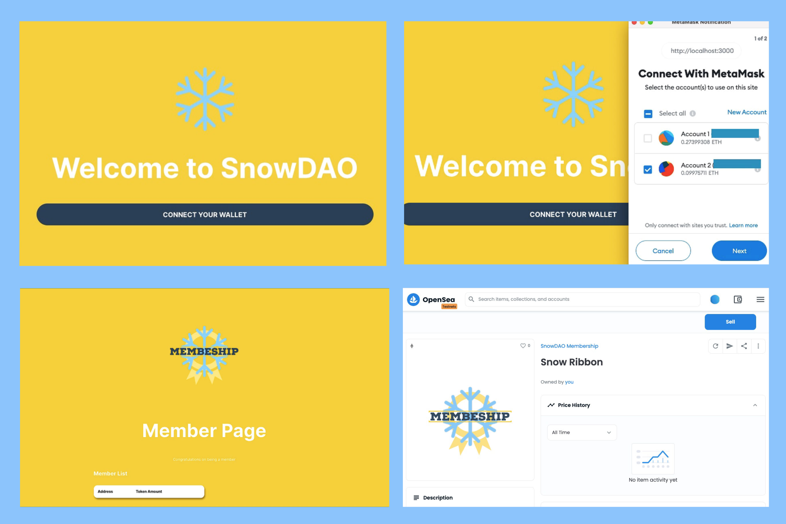

# DAO project with just Javascript
My first decentralized autonomous organization(DAO). An application where skier & snowboarders can obtain a membership, through the purchase of a token(Snow), for free. This can be added to a digital wallet. The app mits SnowDAO Governance Tokens and drops them to selected participants.

#### By Karen Axon

  

  

## Technologies Used
* Javascript
* React
* [thirdweb](https://thirdweb.com/)

## Setup/Installation 

* Click on the [repository's](https://github.com/karenaxon/dao-first-project.git) link.
* Click on the green "Code" button and copy the repository URL.
* Open your terminal and navigate to the location where you would like to clone the application.
* Use the command _git clone https://github.com/karenaxon/dao-first-project.git_ to clone the repository.
* Set up a project and get an API key from [Alchemy]("https://www.alchemy.com/")
* Set up an .env file in the root directory and add the following:
  * `ALCHEMY_API_URL=YourProject'sApiUrlHere`
  * `WALLET_ADDRESS=YourWalletsAddressHere`
  * `PRIVATE_KEY=YourWalletsPrivateKeyHere`
* From the root directory of the application run the following commands:
  * `npm install`
  * `npm start`
* Start coding!

## Using the Application
After following the Setup/Installation steps above...

## Known Bugs
* None

## License

[MIT](https://choosealicense.com/licenses/mit/)

Copyright (c) April 2022 - Karen Axon

## Contact Information:

<h3>Karen Axon</h3>

